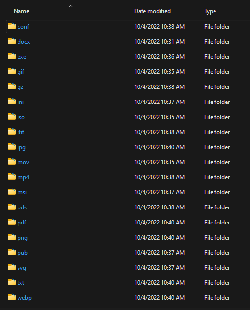

# sortplz

_sortplz_ is a simple file sorter. It takes targeted files, and moves them to subdirectories for further review.

**Usage:** sortplz -f:_fromdir_ -t:_todir_ -e:_ext_ -n:_name_

**Other flags:** _--help (-h)_, _--version (-v)_, _--silent (-s)_, _--recurse (-s)_

## Notes

- You can specify more than one "-e" and/or "-n" options.
- "-e" options check against the file extensions; "-n" options check against the whole filename.
- "-n" options take precedence over "-e" options: it's presumed specific files are more important to sort.

## Changelog

- 2022.10.04.2 -> Initial Release
- 2022.10.04.3 -> Added colored output & partially-successful "silent" flag.
- 2022.11.04.1 -> Added recursion; added name-string sorting; "silent" issues may be fixed?
- 2022.11.13.1 -> Fixes from Nim Discord community.
- 2022.12.13.1 -> Attempted bugfixes

## TODO

- Sort by size, instead of extension
- It'd be nice to have the files/extensions specified without a option.
